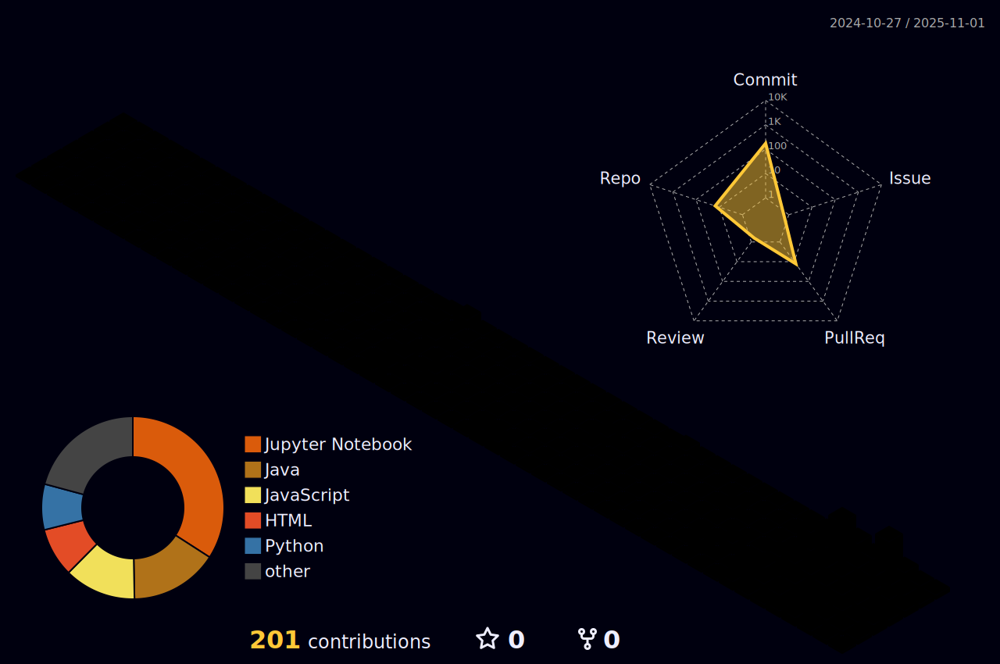

  
# Olá, eu sou Arthur Siqueira! 👋
### Desenvolvedor de Software FullStack

 
  
   

---

### 🌃 Minhas Contribuições

  

---

### 📊 Minhas Estatísticas

  
  

---

### 💻 Tecnologias e Ferramentas

  

